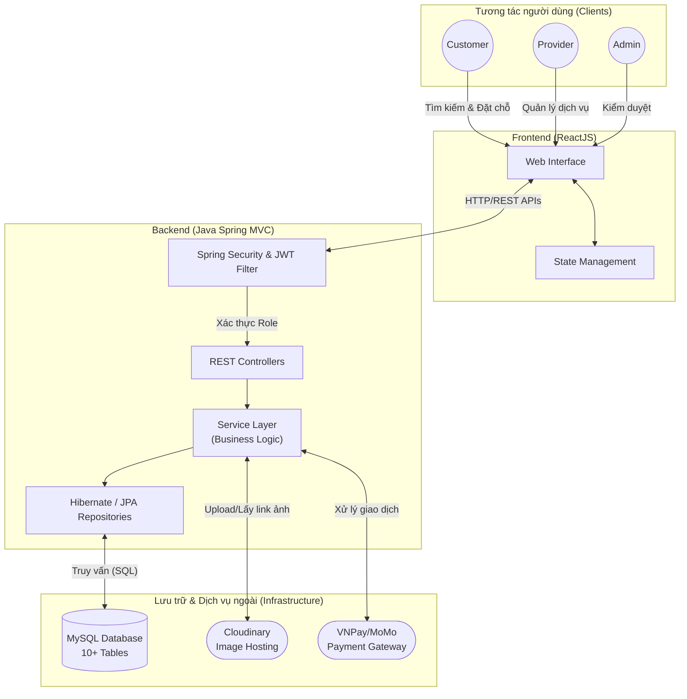
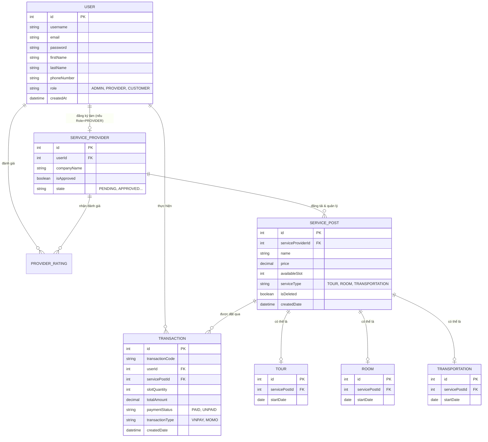

```mermaid
flowchart TB
    %% Định nghĩa các tác nhân
    subgraph Clients["Tương tác người dùng (Clients)"]
        Customer((Customer))
        Provider((Provider))
        Admin((Admin))
    end

    %% Giao diện Frontend
    subgraph Frontend["Frontend (ReactJS)"]
        UI["Web Interface"]
        State["State Management"]
        UI <--> State
    end

    %% Lõi Backend
    subgraph Backend["Backend (Java Spring MVC)"]
        Security["Spring Security & JWT Filter"]
        Controllers["REST Controllers"]
        Services["Service Layer<br>(Business Logic)"]
        Hibernate["Hibernate / JPA Repositories"]
        
        Security -->|"Xác thực Role"| Controllers
        Controllers --> Services
        Services --> Hibernate
    end

    %% Cơ sở dữ liệu và Dịch vụ bên thứ 3
    subgraph Infrastructure["Lưu trữ & Dịch vụ ngoài (Infrastructure)"]
        MySQL[("MySQL Database<br>10+ Tables")]
        Cloudinary(["Cloudinary<br>Image Hosting"])
        Payment(["VNPay/MoMo<br>Payment Gateway"])
    end

    %% Luồng giao tiếp (Data flow)
    Customer -->|"Tìm kiếm & Đặt chỗ"| UI
    Provider -->|"Quản lý dịch vụ"| UI
    Admin -->|"Kiểm duyệt"| UI

    UI <-->|"HTTP/REST APIs"| Security
    Services <-->|"Upload/Lấy link ảnh"| Cloudinary
    Services <-->|"Xử lý giao dịch"| Payment
    Hibernate <-->|"Truy vấn (SQL)"| MySQL
```

```mermaid
erDiagram
    %% Định nghĩa các mối quan hệ (Relationships)
    USER ||--o| SERVICE_PROVIDER : "đăng ký làm (nếu Role=PROVIDER)"
    USER ||--o{ TRANSACTION : "thực hiện"
    USER ||--o{ PROVIDER_RATING : "đánh giá"

    SERVICE_PROVIDER ||--o{ SERVICE_POST : "đăng tải & quản lý"
    SERVICE_PROVIDER ||--o{ PROVIDER_RATING : "nhận đánh giá"

    SERVICE_POST ||--o{ TRANSACTION : "được đặt qua"
    SERVICE_POST ||--o| TOUR : "có thể là"
    SERVICE_POST ||--o| ROOM : "có thể là"
    SERVICE_POST ||--o| TRANSPORTATION : "có thể là"

    %% Cấu trúc bảng USER
    USER {
        int id PK
        string username
        string email
        string password
        string firstName
        string lastName
        string phoneNumber
        string role "ADMIN, PROVIDER, CUSTOMER"
        datetime createdAt
    }

    %% Cấu trúc bảng SERVICE_PROVIDER
    SERVICE_PROVIDER {
        int id PK
        int userId FK
        string companyName
        boolean isApproved
        string state "PENDING, APPROVED..."
    }

    %% Cấu trúc bảng SERVICE_POST (Sản phẩm gốc)
    SERVICE_POST {
        int id PK
        int serviceProviderId FK
        string name
        decimal price
        int availableSlot
        string serviceType "TOUR, ROOM, TRANSPORTATION"
        boolean isDeleted
        datetime createdDate
    }

    %% Cấu trúc bảng GIAO DỊCH
    TRANSACTION {
        int id PK
        string transactionCode
        int userId FK
        int servicePostId FK
        int slotQuantity
        decimal totalAmount
        string paymentStatus "PAID, UNPAID"
        string transactionType "VNPAY, MOMO"
        datetime createdDate
    }

    %% Các bảng con (Đa hình dịch vụ)
    TOUR {
        int id PK
        int servicePostId FK
        date startDate
    }
    
    ROOM {
        int id PK
        int servicePostId FK
        date startDate
    }
    
    TRANSPORTATION {
        int id PK
        int servicePostId FK
        date startDate
    }
```
